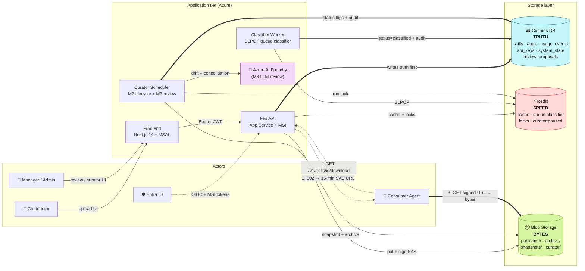

# Agentic Skill Hub

Internal web platform for submitting, reviewing, publishing, and maintaining reusable agent skills.

**Status:** M0 POC scaffolded. Local end-to-end flow runs on emulators (zero Azure spend).

## Docs

- [PRD](docs/PRD.md) — product requirements, architecture, milestones
- [ARCHITECTURE.md](docs/ARCHITECTURE.md) — full architecture map (v2.0)
- [AGENTS.md](AGENTS.md) — conventions and the non-negotiable Redis rules
- [docs/architecture.excalidraw](docs/architecture.excalidraw) — editable diagram
- [.agents/plans/m0-poc-end-to-end-skill-submission.md](.agents/plans/m0-poc-end-to-end-skill-submission.md) — M0 plan

## Architecture at a glance



**Legend**
- `==>` thick = primary write path (Cosmos-first) and the bytes hop the agent actually downloads.
- `-->` thin = supporting cache / lock / SAS / message-queue interactions.
- `-.->` dotted = identity / consumer-agent request flow (3 numbered hops).

Storage split (full rationale in [docs/ARCHITECTURE.md §9](docs/ARCHITECTURE.md) and AGENTS.md §3):

| Store | Role | Loss tolerance |
|-------|------|----------------|
| **Cosmos DB** | Truth — every durable fact | Catastrophic — irrecoverable |
| **Blob Storage** | Bytes — immutable bundles + snapshots | Catastrophic — only recoverable from snapshots |
| **Redis** | Speed + ephemeral coordination | Acceptable — rebuilds from Cosmos in seconds |

## Stack

- Backend: FastAPI (Python 3.12)
- Frontend: Next.js 14 + Tailwind
- Database (SoR): Azure Cosmos DB for NoSQL (emulator locally)
- Cache + queue: Redis 7 (AOF on the classifier queue)
- Storage: Azure Blob Storage (Azurite locally)
- Auth: Entra ID OIDC in M1; `X-User-Email` header stub for M0
- Local dev: `docker compose up -d` brings up Cosmos emulator + Azurite + Redis

## Quickstart

```bash
# 1. Copy env defaults
cp .env.local.example .env.local

# 2. Start emulator stack
docker compose up -d
python scripts/wait_for_emulators.py

# 3. Install backend deps (pick one)
pip install -e ".[dev]"
# or: uv sync

# 4. Install frontend deps
pnpm --filter frontend install   # or `cd frontend && pnpm install`

# 5. Run in three terminals
make api       # FastAPI on :8000
make worker    # classifier worker
make web       # Next.js on :3000

# 6. Seed a few sample skills (optional)
make seed
```

Open <http://localhost:3000>, switch the user picker to `alice@org`, drag in
`scripts/fixtures/example-skill.md` on the Upload page, watch the status flip
from `pending → classified` within ~10s, switch to `manager@org`, approve from
the Review queue, then `curl http://localhost:8000/v1/skills | jq` to see it
in the public catalog.

### Running against real Entra (oidc mode)

The persona picker only exists in `AUTH_MODE=stub`. To smoke-test the real
Entra redirect flow locally:

```bash
# 1. Provision app regs + admin group in the signed-in tenant.
#    Re-runnable; safe to repeat.
bash scripts/setup-entra.sh dev localhost

# 2. Add yourself to the admin group (object id printed at the end of step 1).
az ad group member add --group <group-id> --member-id "$(az ad signed-in-user show --query id -o tsv)"

# 3. Drop the four IDs from the script's summary into .env.local:
#       AUTH_MODE=oidc
#       LOCAL_DEV=1
#       ENTRA_TENANT_ID=<tenant guid>
#       ENTRA_CLIENT_ID=<api app guid>
#       ENTRA_GROUP_ID_ADMIN=<group object id>
#    …and frontend/.env.local:
#       NEXT_PUBLIC_AUTH_MODE=oidc
#       NEXT_PUBLIC_API_BASE=http://localhost:8000
#       NEXT_PUBLIC_ENTRA_TENANT_ID=<tenant guid>
#       NEXT_PUBLIC_ENTRA_CLIENT_ID=<spa app guid>
#       NEXT_PUBLIC_ENTRA_API_SCOPE=api://<api app guid>/access_as_user

# 4. Restart both processes so the new env is picked up.
make api
make web
```

Open <http://localhost:3000>; you'll be redirected to Entra, sign in, land
back on `/auth/callback`, then the app. Admin nav appears if your account
is in `skillhub-admins-dev`. Detailed contract in `AGENTS.md` §6a.

## Tests

```bash
# Unit tests — no docker required
make test-unit

# Integration tests — require docker compose stack
make up && make wait
make test-integration

# Full end-to-end happy path
make demo
```

## Project layout

```
backend/
  api/             # FastAPI routers
  core/            # Settings, clients, errors, auth, logging
  services/        # Business logic (Cosmos-first)
  workers/         # classifier (BLPOP loop)
  tests/{unit,integration}/
frontend/          # Next.js 14 app router
scripts/           # seed_skills.py, wait_for_emulators.py
docker-compose.yml # cosmos emulator + azurite + redis
docs/PRD.md
AGENTS.md
```

## The four non-negotiable Redis rules

1. Cosmos-first writes. Redis is invalidated after Cosmos succeeds.
2. Every Redis read has a Cosmos fallback. Cache miss != error.
3. TTL everything. No infinite-lived keys.
4. The classifier queue is the only ephemeral data — mitigated by AOF + Cosmos pending-doc-first + a future janitor sweep.

See [AGENTS.md §4](AGENTS.md).
