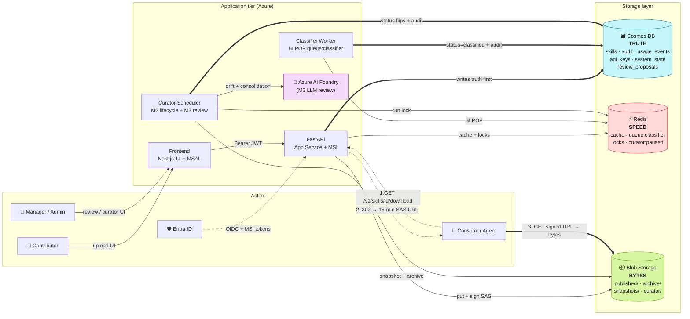

# Agentic Skill Hub

Internal web platform for submitting, reviewing, publishing, and maintaining reusable agent skills.

**Status:** M0 POC scaffolded. Local end-to-end flow runs on emulators (zero Azure spend).

## Docs

- [PRD](docs/PRD.md) — product requirements, architecture, milestones
- [ARCHITECTURE.md](docs/ARCHITECTURE.md) — full architecture map (v2.0)
- [AGENTS.md](AGENTS.md) — conventions and the non-negotiable Redis rules
- [docs/architecture.excalidraw](docs/architecture.excalidraw) — editable diagram
- [.agents/plans/m0-poc-end-to-end-skill-submission.md](.agents/plans/m0-poc-end-to-end-skill-submission.md) — M0 plan

## Architecture at a glance



**Legend**
- `==>` thick = primary write path (Cosmos-first) and the bytes hop the agent actually downloads.
- `-->` thin = supporting cache / lock / SAS / message-queue interactions.
- `-.->` dotted = identity / consumer-agent request flow (3 numbered hops).

Storage split (full rationale in [docs/ARCHITECTURE.md §9](docs/ARCHITECTURE.md) and AGENTS.md §3):

| Store | Role | Loss tolerance |
|-------|------|----------------|
| **Cosmos DB** | Truth — every durable fact | Catastrophic — irrecoverable |
| **Blob Storage** | Bytes — immutable bundles + snapshots | Catastrophic — only recoverable from snapshots |
| **Redis** | Speed + ephemeral coordination | Acceptable — rebuilds from Cosmos in seconds |

## Stack

- Backend: FastAPI (Python 3.12)
- Frontend: Next.js 14 + Tailwind
- Database (SoR): Azure Cosmos DB for NoSQL (emulator locally)
- Cache + queue: Redis 7 (AOF on the classifier queue)
- Storage: Azure Blob Storage (Azurite locally)
- Auth: Entra ID OIDC in M1; `X-User-Email` header stub for M0
- Local dev: `docker compose up -d` brings up Cosmos emulator + Azurite + Redis
- Runtime (M4+): AKS + ACR + Workload Identity. See [`infra/README.md`](infra/README.md).

### Local dev vs deploy target

The contributor loop is `docker compose up` + `make` (AGENTS.md §6). **You
do not need `kubectl`, `helm`, or an AKS cluster to develop on this
project.** AKS, the umbrella Helm chart in `charts/agentic-skill-hub/`,
and the four Dockerfiles are deploy concerns owned by the
`deploy-aks.yml` workflow. Ops runbook: [`infra/README.md`](infra/README.md).

## Quickstart

```bash
# 1. Copy env defaults
cp .env.local.example .env.local

# 2. Start emulator stack
docker compose up -d
python scripts/wait_for_emulators.py

# 3. Install backend deps (pick one)
pip install -e ".[dev]"
# or: uv sync

# 4. Install frontend deps
pnpm --filter frontend install   # or `cd frontend && pnpm install`

# 5. Run in three terminals
make api       # FastAPI on :8000
make worker    # classifier worker
make web       # Next.js on :3000

# 6. Seed a few sample skills (optional)
make seed
```

Open <http://localhost:3000>, switch the user picker to `alice@org`, drag in
`scripts/fixtures/example-skill.md` on the Upload page, watch the status flip
from `pending → classified` within ~10s, switch to `manager@org`, approve from
the Review queue, then `curl http://localhost:8000/v1/skills | jq` to see it
in the public catalog.

### Running against real Entra (oidc mode)

The persona picker only exists in `AUTH_MODE=stub`. To smoke-test the real
Entra redirect flow locally:

```bash
# 1. Provision app regs + admin group in the signed-in tenant.
#    Re-runnable; safe to repeat.
bash scripts/setup-entra.sh dev localhost

# 2. Add yourself to the admin group (object id printed at the end of step 1).
az ad group member add --group <group-id> --member-id "$(az ad signed-in-user show --query id -o tsv)"

# 3. Drop the four IDs from the script's summary into .env.local:
#       AUTH_MODE=oidc
#       LOCAL_DEV=1
#       ENTRA_TENANT_ID=<tenant guid>
#       ENTRA_CLIENT_ID=<api app guid>
#       ENTRA_GROUP_ID_ADMIN=<group object id>
#    …and frontend/.env.local (unprefixed; read at runtime via /env.js
#    in deployed pods, and inlined by next dev locally):
#       AUTH_MODE=oidc
#       API_BASE=http://localhost:8000
#       ENTRA_TENANT_ID=<tenant guid>
#       ENTRA_CLIENT_ID=<spa app guid>
#       ENTRA_API_SCOPE=api://<api app guid>/access_as_user

# 4. Restart both processes so the new env is picked up.
make api
make web
```

Open <http://localhost:3000>; you'll be redirected to Entra, sign in, land
back on `/auth/callback`, then the app. Admin nav appears if your account
is in `skillhub-admins-dev`. Detailed contract in `AGENTS.md` §6a.

## Tests

```bash
# Unit tests — no docker required
make test-unit

# Integration tests — require docker compose stack
make up && make wait
make test-integration

# Full end-to-end happy path
make demo
```

## Deploying to Azure

Two-stage deployment by design:

1. **`azd up`** provisions the Azure footprint (AKS + ACR + Cosmos + Redis + Storage + Key Vault + UAMIs + RBAC) from Bicep.
2. **`deploy-aks.yml`** (GitHub Actions) builds the four images, pushes them to ACR, and `helm upgrade`s the umbrella chart.

This split exists because `azure.yaml` predates the M4 move to AKS — `azd deploy` would try to push to App Service / Static Web App hosts that no longer exist. Use `azd` only for the infra lifecycle; ship application changes via GitHub Actions.

Detailed ops runbook (rollback, image rotation, troubleshooting): [`infra/README.md`](infra/README.md).

### Prerequisites

- Azure subscription with **Owner** on the target resource group (RBAC role assignments needed)
- Tenant roles: **Application Administrator** + **Groups Administrator** (or Global Admin) to run `setup-entra.sh`
- Tools: `az`, `azd`, `gh`, `helm`, `kubectl`, `jq`, `docker`

```bash
az login
azd auth login
```

### Step 1 — Provision Entra (once per environment)

`scripts/setup-entra.sh` is idempotent and creates the backend API app, the SPA app, and the `skillhub-admins-<env>` security group.

```bash
# Use '-' as the second arg for localhost-only redirects (no prod hostname yet).
bash scripts/setup-entra.sh dev <frontend-hostname>
# e.g. bash scripts/setup-entra.sh dev skillhub-dev.example.com
# or:  bash scripts/setup-entra.sh dev -
```

The script prints a copy-paste block at the end. Save four values — you need them in step 2 and step 5:

| Value | Used in |
|-------|---------|
| `ENTRA_TENANT_ID` | bicepparam + frontend env |
| `ENTRA_CLIENT_ID` *(API app id)* | bicepparam + frontend `ENTRA_API_SCOPE` |
| `SPA_APP_ID` | frontend `ENTRA_CLIENT_ID` |
| `ENTRA_GROUP_ID_ADMIN` *(admin group object id)* | bicepparam |

Add yourself to the admin group so you get admin role in the deployed app:

```bash
az ad group member add --group <group-id> \
  --member-id "$(az ad signed-in-user show --query id -o tsv)"
```

Full contract for what the script provisions (scopes, group claims, pre-authorization): [AGENTS.md §6a](AGENTS.md).

### Step 2 — Export Entra IDs to the azd environment

The Entra tenant + app IDs are environment-specific and tenant-scoped — we
do **not** commit them. They flow into the Bicep deployment via
`readEnvironmentVariable()` in `infra/parameters/<env>.bicepparam`, sourced
from the azd environment:

```bash
azd env new dev                    # env name MUST be dev | staging | prod
azd env set AZURE_LOCATION       eastus2
azd env set AUTH_MODE            oidc
azd env set ENTRA_TENANT_ID      <tenant-id>
azd env set ENTRA_CLIENT_ID      <api-app-id>
azd env set ENTRA_SPA_CLIENT_ID  <spa-app-id>
azd env set ENTRA_GROUP_ID_ADMIN <admin-group-id>
```

GitHub Actions reads the same IDs from Bicep outputs at deploy time — they
never have to be wired into the workflow separately.

### Step 3 — Provision infra (`azd up`)

```bash
azd up                             # runs azd provision under the hood
```

`azd up` will:
- Create resource group `rg-<env>` if missing
- Deploy `infra/main.bicep` with `parameters/<env>.bicepparam`
- Provision ACR, AKS (Workload Identity + OIDC issuer + AGIC), 5 UAMIs with federated credentials, Cosmos / Redis / Storage / Key Vault, all RBAC

Cosmos data-plane RBAC takes ~5min to propagate — `/health` will return 403 from Cosmos until then.

### Step 4 — Seed Key Vault secrets

A few secrets can't be auto-generated by Bicep:

```bash
KV=$(azd env get-value KEY_VAULT_NAME 2>/dev/null || echo kv-skillhub-dev-eastus2)

az keyvault secret set --vault-name $KV \
  --name apikey-pepper --value "$(openssl rand -hex 32)"

# Only if you're enabling the M3 LLM curator review:
az keyvault secret set --vault-name $KV \
  --name foundry-api-key --value <key>
```

The SPA is a public client (MSAL PKCE) and the backend validates JWTs via
JWKS, so there is no `entra-client-secret` to seed.

Cosmos / Redis / Storage keys are populated by the `rotate-key.yml` workflow on first run.

The CSI Secrets Store driver (Azure addon, enabled in `infra/modules/aks.bicep`)
polls Key Vault every 2 minutes and mirrors each listed secret into a K8s
Secret named `<release>-<component>-<kv-secret-name>` — the deployments
expose them as env vars via `valueFrom: secretKeyRef`. No secret value
ever appears in a Helm release, kubectl manifest, or git.

### Step 5 — Install KEDA (once per cluster)

KEDA is the scaler that drives the classifier worker to/from zero on `LLEN queue:classifier`. It's deliberately not bundled in the umbrella chart so cluster operators can upgrade it independently.

```bash
az aks get-credentials -g rg-dev -n skillhub-dev-eastus2-aks --overwrite-existing
helm repo add kedacore https://kedacore.github.io/charts
helm install keda kedacore/keda --namespace keda --create-namespace
```

### Step 6 — Configure GitHub environment

In **Settings → Environments → dev** (create the env if missing):

| Variable | Value |
|----------|-------|
| `FRONTEND_HOST` | `agentic-curator.com` |
| `BACKEND_HOST`  | `api.agentic-curator.com` |

These are chart-time inputs (not Bicep outputs) used by `helm upgrade --set ingress.hosts.*`.

Wire up GitHub federated credentials so the deploy workflow can `az login` without a stored secret. The helper script creates a dedicated CI UAMI (`id-skillhub-<env>-github`), federates it to the repo, and assigns the five roles `deploy-aks.yml` needs (Contributor on RG, AcrPush on ACR, AKS Cluster User + RBAC Cluster Admin, KV Secrets Officer):

```bash
bash scripts/setup_federated_credentials.sh dev
```

The script prints three repo-level secrets to set (`AZURE_CLIENT_ID`,
`AZURE_TENANT_ID`, `AZURE_SUBSCRIPTION_ID`). Set them via `gh secret set`.

### Step 7 — First deploy

```bash
gh workflow run deploy-aks.yml -f env=dev
```

The workflow has 4 jobs: `infra` → `images` → `helm` → `smoke`. `--atomic --wait` rolls back automatically if any Deployment never goes Ready; the smoke job runs `helm rollback` if `/health` doesn't return 200.

Subsequent deploys are just `gh workflow run deploy-aks.yml -f env=dev` — `azd up` is a one-shot infra step, not a per-deploy operation.

### Tearing down

`azd down` deletes everything in `rg-<env>`. It does **not** delete Entra app registrations or the admin security group — those live at the tenant level.

```bash
# Preview first — shows exactly what will be deleted, makes no changes
azd down --preview

# Real teardown. --purge hard-deletes soft-deleted Key Vault / Cognitive
# Services / Cosmos so the names aren't reserved for 7-90 days.
azd down --force --purge
```

To also clean up Entra (only do this if you're not redeploying):

```bash
az ad app delete --id <api-app-id>
az ad app delete --id <spa-app-id>
az ad group delete --group <admin-group-id>
```

You can find the IDs in `.azure/<env>/.env` or by re-running `bash scripts/setup-entra.sh <env>` (idempotent — it'll print the existing IDs).

## Project layout

```
backend/
  api/             # FastAPI routers
  core/            # Settings, clients, errors, auth, logging
  services/        # Business logic (Cosmos-first)
  workers/         # classifier (BLPOP loop)
  tests/{unit,integration}/
frontend/          # Next.js 14 app router
scripts/           # seed_skills.py, wait_for_emulators.py
docker-compose.yml # cosmos emulator + azurite + redis
docs/PRD.md
AGENTS.md
```

## The four non-negotiable Redis rules

1. Cosmos-first writes. Redis is invalidated after Cosmos succeeds.
2. Every Redis read has a Cosmos fallback. Cache miss != error.
3. TTL everything. No infinite-lived keys.
4. The classifier queue is the only ephemeral data — mitigated by AOF + Cosmos pending-doc-first + a future janitor sweep.

See [AGENTS.md §4](AGENTS.md).
